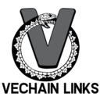

# VeChainLinks - Automatic Updates and News of VeChain!

<p align="center">
 
</p>


[vechainlinks.com](https://vechainlinks.com) is a place where you find interesting people, project updates and news from big names in VeChain eco-system. Driven by the community and welcomes PR!

## Client Interfaces
- RSS
- Email Subscription
- Web

## How to Build & Test on Local Machine

Run the project:
```
npm install
npm run dev
```

Visit in Browser:
```
dist/index.html
```

Edit to update:
```
src/data/data.json
```

Commit your changes to `data.json` and push the changes to Github!

# Development History

## Milestone #1: Build a Simple Static Website

Target: Collect Links inside VeChain eco-system.
- Medium
- Twitter
- Reddit
- Weibo
- Official Sites
- Standalone Media Sites
- Useful Tools.
- Telegram Channels
- Codes: VeChain
- Documentation for developers.
- Dapps URLs, Dapps Githubs

Result:
- [x] A simple working static site.
- [x] 5 users to comment about the website.
- [x] Open for public members to contribute.

## Milestone #2: Make the Website Dynamic

Apart from above "static" goals, build a "scraper" or "reporter" system, that automatically gathers information from Twitter/Medium/Reddit/Github to show "progress" of the VeChain.

Target #1:
- { Reddit, Medium, WP } Feeds -- RSS can be obtained directly.
- { Twitter, Weibo } Feeds. -- RSS can be obtained from 3rd party.
- { Website } - simple hash-then-cache scrapper bot.
- { Telegram, Github } - Need to develop ourselves.
- Standardize the "social media" backend and output a single RSS API: {bot_type:, user_identifier:, newest:, previous_cache:}
- Cache the RSS result, server fetch from source every X minutes.

Problem Solving:

Reddit: [Atom-1.0]
https://www.reddit.com/r/VeChain/.rss

Medium: [RSS-2]
https://medium.com/feed/@Medium

WP: RSS, [RSS-2], [Atom-1.0] 
http://vechain101.com/?feed=rss2
http://vechain101.com/?feed=atom

Twitter: [RSS-2.0]
https://queryfeed.net/tw?q=%40abyteahead

Weibo: [RSS-2.0]
https://rssfeed.today/weibo/rss/6353774918

Github: [Atom-1.0]
https://github.com/vechain/thor/releases.atom
https://github.com/vechain/thor/tags.atom
https://github.com/vechain/thor/commits/master.atom
https://github.com/vechain/thor/commits.atom

We output feeds with RSS-2.0 style。

Target #2:
- A Dynamic frontend to display Feeds (excerpt)
- The frontend should be fully static (many data rendered beforehand)
- A Dynamic Backend to collect RSS and serve API.
- Use a simple package manager to automate the build process.

Result:
- [x] A backend, to collect feeds on different platforms, and turning into RSS.
- [x] A simple, dynamic website frontend, to poll RSS feed and display.
- [x] Get 20 users to comment about the website.
- [x] Open for public members to contribute.

## Milestone #3: Subscribe and Analyze

- [x] Google Analytics
- [x] Email Subscribers
- [x] Get first 50 users on board.
- [x] Permanent Link Center.


### Honorable Mentions
<div>Icons made by <a href="https://www.flaticon.com/authors/pixel-perfect" title="Pixel perfect">Pixel perfect</a> from <a href="https://www.flaticon.com/" title="Flaticon">www.flaticon.com</a></div>

<div>Icons made by <a href="https://www.flaticon.com/authors/roundicons" title="Roundicons">Roundicons</a> from <a href="https://www.flaticon.com/" title="Flaticon">www.flaticon.com</a></div>

Icons made by <a href="https://www.flaticon.com/authors/google" title="Google">Google</a> from <a href="https://www.flaticon.com/" title="Flaticon"> www.flaticon.com</a>

<p>User Guide Library <a href="https://introjs.com/">Intro.js</a><p>